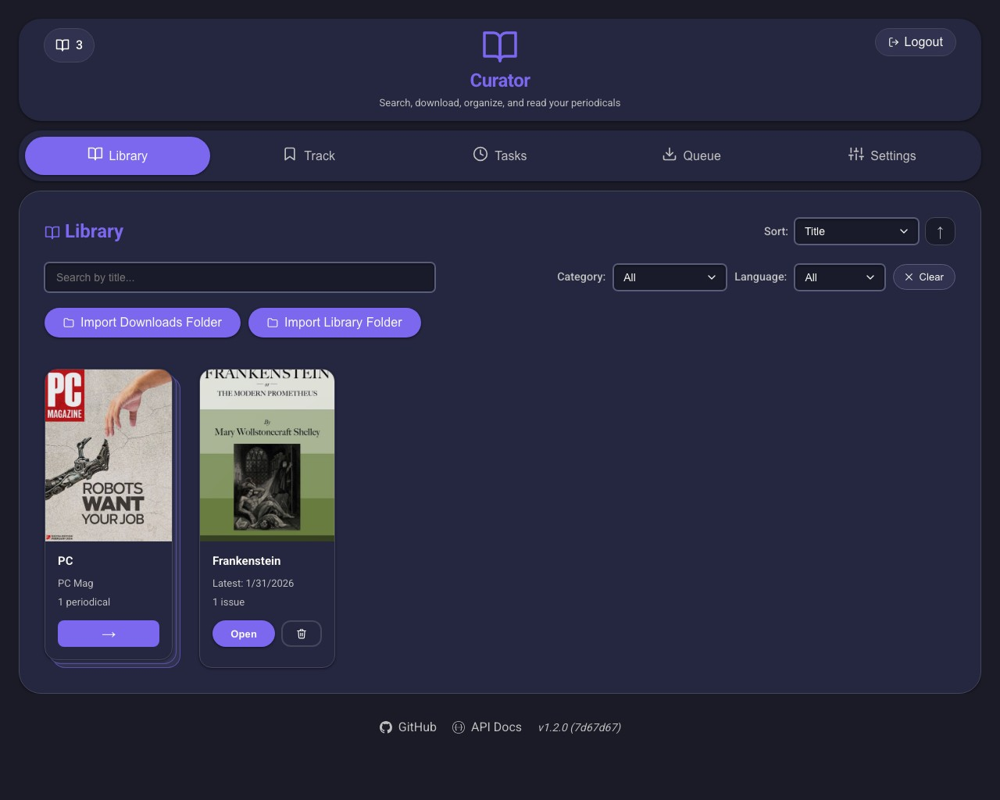

# Curator

Automatically discover, download, and organize periodicals (magazines, comics, newspapers) with a modern web interface.

## Features

- **Smart Search** - Multi-provider search with intelligent deduplication
- **Internet Archive** - Free access to millions of magazines, comics, and newspapers
- **Torrent Support** - Torznab search providers (Prowlarr, Jackett) with qBittorrent
- **Auto Downloads** - Track periodicals for automatic downloads
- **Stacks** - Organize periodicals into custom collections
- **Clean Library** - Automatic organization with consistent naming and cover art
- **OCR Metadata** - Extract issue numbers and dates from cover images
- **Web Interface** - Modern, responsive UI to browse and manage your collection
- **Background Tasks** - Automated monitoring, cleanup, and processing



## Requirements

- Docker (recommended) or Python 3.13+
- Newsnab or Torznab indexer (optional - Prowlarr, NZBHydra2, Jackett, etc.)
- Download client (optional - SABnzbd or NZBGet for Usenet; qBittorrent for torrents)

## Quick Start

### Docker (Recommended)

```bash
# Create directories
mkdir -p local/config local/data local/downloads

# Copy config template
cp config.template.yaml local/config/config.yaml

# Edit configuration (see minimal config below)
nano local/config/config.yaml

# Run with Docker
docker run -d \
  --name curator \
  -p 8000:8000 \
  -v $(pwd)/local/config:/app/local/config \
  -v $(pwd)/local/data:/app/local/data \
  -v $(pwd)/local/downloads:/app/local/downloads \
  chadleeshaw/curator:latest
```

**Docker Compose:**

```yaml
services:
  curator:
    image: chadleeshaw/curator:latest
    container_name: curator
    restart: unless-stopped
    ports:
      - '8000:8000'
    volumes:
      - ./local/config:/app/local/config
      - ./local/data:/app/local/data
      - ./local/downloads:/app/local/downloads
    environment:
      - TZ=America/New_York
```

### Minimal Configuration

Internet Archive requires no API key and provides millions of free periodicals:

```yaml
search_providers:
  - type: internet_archive
    name: Internet Archive
    enabled: true
    priority: 1
    collections:
      - magazines
      - periodicals
      - comics
```

Add Newsnab indexer (optional):

```yaml
- type: newsnab
  name: Prowlarr
  enabled: true
  api_url: 'http://your-prowlarr:9696/api'
  api_key: 'your_api_key_here'
  priority: 50
```

Add download client for Usenet (optional):

```yaml
download_client:
  type: sabnzbd
  name: SABnzbd
  api_url: 'http://your-sabnzbd:8080'
  api_key: 'your_api_key_here'
```

### Access

Open http://localhost:8000 and start managing your periodicals.

## Using Curator

### Search & Download

1. Navigate to **Search**
2. Enter periodical title (e.g., "National Geographic")
3. Results are automatically deduplicated across all providers
4. Select results and download

### Stacks

Organize your periodicals into custom collections:

1. Navigate to **Stacks**
2. Create a new stack (e.g., "Sci-Fi Magazines", "Vintage Comics")
3. Add periodicals or tracking items to stacks
4. View stack-specific library and tracking pages
5. Bulk operations work within stacks

### Track for Auto-Downloads

1. Navigate to **Tracking**
2. Search for a periodical
3. Configure tracking preferences:
   - Track all editions
   - Track new issues only
   - Select specific editions
4. Curator automatically downloads new issues as they're released

### Browse Library

**Library** shows your organized collection with:

- Cover thumbnails
- Metadata (dates, issue numbers, volumes, special editions)
- Quick file access and management
- Bulk operations (move, delete, regenerate covers)

## Configuration

### Environment Variables

| Variable               | Default                    | Description                             |
| ---------------------- | -------------------------- | --------------------------------------- |
| `TZ`                   | System                     | Timezone (e.g., `America/New_York`)     |
| `DISABLE_OCR`          | `false`                    | Disable OCR processing (reduces memory) |
| `CURATOR_CONFIG_PATH`  | `local/config/config.yaml` | Config file location                    |
| `CURATOR_DB_PATH`      | `local/data/curator.db`    | Database location                       |
| `CURATOR_DOWNLOAD_DIR` | `local/downloads`          | Download directory                      |
| `CURATOR_LIBRARY_DIR`  | `local/data`               | Library directory                       |
| `CURATOR_LOG_LEVEL`    | `INFO`                     | Log level (DEBUG, INFO, WARNING, ERROR) |
| `CURATOR_HOST`         | `0.0.0.0`                  | Server bind address                     |
| `CURATOR_PORT`         | `8000`                     | Server port                             |

### Search Providers

**Internet Archive** (free, no API key):

```yaml
search_providers:
  - type: internet_archive
    name: Internet Archive
    enabled: true
    priority: 1
    collections:
      - magazines
      - periodicals
      - americana
      - newspaper
      - comics
    max_results: 500
```

**Newsnab** (Prowlarr, NZBHydra2, etc.):

```yaml
- type: newsnab
  name: Prowlarr
  api_url: 'http://prowlarr:9696/api'
  api_key: 'your_key'
  enabled: true
  priority: 50
  categories: '7000,7010,7020,7030'
  search_limit: 250
```

**RSS** (fast new release discovery):

```yaml
- type: rss
  name: MyRSS
  feed_url: 'http://example.com/feed.rss'
  enabled: true
  priority: 50
```

**Torznab** (Prowlarr, Jackett — torrent indexers):

```yaml
- type: torznab
  name: Prowlarr
  api_url: 'http://prowlarr:9696/1/api'
  api_key: 'your_key'
  enabled: true
  priority: 50
  categories: '7010,7020,7030'
  search_limit: 100
```

> Torznab providers require a qBittorrent download client (see below).

### Download Clients

**Internet Archive** uses built-in HTTP client (no external client needed):

```yaml
download_clients:
  internet_archive:
    max_concurrent_downloads: 3
    timeout_seconds: 300
```

**SABnzbd** (for Usenet/Newsnab):

```yaml
download_client:
  type: sabnzbd
  name: SABnzbd
  api_url: 'http://sabnzbd:8080'
  api_key: 'your_key'
```

**NZBGet** (for Usenet/Newsnab):

```yaml
download_client:
  type: nzbget
  name: NZBGet
  api_url: 'http://nzbget:6789'
  username: 'nzbget'
  password: 'your_password'
```

**qBittorrent** (for Torznab providers):

```yaml
download_clients:
  - type: qbittorrent
    name: qBittorrent
    api_url: 'http://qbittorrent:8090'
    username: 'admin'
    password: 'your_password'
    default_category: curator
```

### Storage

Organize your library with custom patterns:

```yaml
import:
  organization_pattern: '{category}/{title}/{title} - {date}'
  category_prefix: '_'
  enable_ocr: true
```

Example structure:

```
local/data/
├── _Comics/
│   └── Batman/
│       └── Batman - 2024-01.pdf
└── _Magazines/
    └── National Geographic/
        └── National Geographic - 2024-01.pdf
```

See [`config.template.yaml`](config.template.yaml) for all options including provider caching, metadata aggregation, OCR tuning, and task scheduling.

## Development

### Local Setup

```bash
# Install dependencies
pip install -r requirements.txt
npm install

# Copy config
cp config.template.yaml local/config/config.yaml

# Install Git hooks
make install-hooks

# Run application
python main.py
```

### Available Commands

```bash
make help                # Show all commands
make install             # Install dependencies
make run                 # Run the application
make test                # Run all tests
make test-unit           # Fast unit tests only
make test-coverage       # Run tests with coverage
make lint                # Check code style
make ci-lint             # CI linters (matches GitHub Actions)
make format              # Auto-format code
make clean               # Clean build artifacts
make screenshots         # Capture all UI screenshots (app must be running)
make screenshot-library  # Capture library tab screenshot only
```

The project includes a pre-push Git hook that runs `make ci-lint` automatically.

## Troubleshooting

**Container keeps restarting:**

```bash
# Check logs
docker logs curator

# Common fixes:
# - Exit code 137: Out of memory → Add DISABLE_OCR=true
# - Exit code 132: No AVX2 support → Add DISABLE_OCR=true
```

**Can't connect to download client:**

- Verify `api_url` in config (use container names if on Docker network)
- Check API key is correct
- Ensure download client is running

**No search results:**

- Internet Archive requires no setup - should work immediately
- For Newsnab: verify indexer is running and accessible
- Check API key and URL in config
- Review logs: `docker logs curator`

## Architecture

```
curator/
├── core/           # Configuration, parsers, utilities
├── models/         # Database models (SQLAlchemy)
├── providers/      # Search providers (Internet Archive, Newsnab, Torznab, RSS)
├── clients/        # Download clients (Internet Archive, SABnzbd, NZBGet, qBittorrent)
├── services/       # Business logic (import, organize, OCR)
├── schedulers/     # Background tasks (monitoring, cleanup)
├── web/            # FastAPI API & routers
└── static/         # Web UI (JavaScript ES6 modules)
```

## Documentation

- [Terminology Guide](docs/TERMINOLOGY.md) - Core concepts (periodicals, issues, variants, editions)

## License

MIT License - See [LICENSE](LICENSE) file for details.
