# Periodical Lifecycle

End-to-end flow from tracking configuration to library import.

```mermaid
flowchart TD
    %% ── TRACKING SETUP ────────────────────────────────
    A([User adds PeriodicalTracking]) --> B{Tracking mode?}
    B -->|track_all_editions| C[Download all issues]
    B -->|track_new_only| D[Download recent issues only]
    B -->|selected_years / selected_editions| E[Download specific issues]

    %% ── SCHEDULED SEARCH ──────────────────────────────
    C & D & E --> F[SearchScheduler selects overdue tracking records]
    F --> G[DownloadManager.search_periodical_issues\nqueries all SearchProviders]
    G --> H[SearchResults returned]

    %% ── ISSUE DISCOVERY ───────────────────────────────
    H --> I[IssueDiscoveryService.record_search_results\nvalidates & deduplicates]
    I --> J{Already in\nDiscoveredIssue?}
    J -->|Yes| K[Update last_seen, times_seen,\nprefer newer NZB URL]
    J -->|No| L[Create DiscoveredIssue\nstatus = discovered]

    K & L --> M[IssueDiscoveryService.evaluate_discovered_issues]

    M --> N{Already in\nlibrary?}
    N -->|Yes| O[status = completed\nlink periodical_id]

    N -->|No| P{Matches\ntracking rules?}
    P -->|No| Q[status = ignored]
    P -->|Yes| R[status = wanted\ncalculate priority]

    %% ── DOWNLOAD QUEUE ────────────────────────────────
    R --> S[DownloadManager.submit_from_discovered_issue]
    S --> T{At concurrent\ndownload limit?}
    T -->|Yes| U[status = queued\nDownloadSubmission QUEUED]
    T -->|No| V[Submit to DownloadClient\nSABnzbd / NZBGet / IA]

    U --> W[DownloadManager.process_queue\nwhen slot opens]
    W --> V

    V --> X{Client\naccepted?}
    X -->|No| Y[status = failed\nDownloadSubmission FAILED]
    X -->|Yes| Z[DownloadSubmission PENDING\nstatus = pending\njob_id stored]

    %% ── DOWNLOAD MONITORING ───────────────────────────
    Z --> AA[DownloadMonitor polls client\nfor job status]
    AA --> AB{Client status?}
    AB -->|downloading| AC[DownloadSubmission DOWNLOADING\nDiscoveredIssue = downloading]
    AB -->|completed| AD[DownloadSubmission COMPLETED\nfile_path stored]
    AB -->|failed| AE[DownloadSubmission FAILED]
    AC --> AA

    %% ── FAILURE HANDLING ──────────────────────────────
    AE & Y --> AF{Retries\nexhausted?}
    AF -->|No| AG[status = failed\nreduce priority\nretry on next queue run]
    AF -->|Yes| AH[status = permanently_failed]
    AG --> S

    %% ── FILE IMPORT ───────────────────────────────────
    AD --> AI[DownloadMonitor._process_single_file]
    AI --> AJ[create_sidecar_file\npreserves tracking association]
    AJ --> AK[FileImporter.import_supported_files]

    AK --> AL[Extract cover art\nPDF / EPUB / CBZ / CBR]
    AL --> AM[Parse filename & text\nbuild parsed_metadata]
    AM --> AN[Match to PeriodicalTracking\nvia TrackingMatcher]
    AN --> AO[Organize file into library\nvia FileOrganizer]
    AO --> AP[Create Periodical record\nin database]

    %% ── POST-IMPORT ───────────────────────────────────
    AP --> AQ[Queue OCRJob if needed\nstatus = pending]
    AQ --> AR[OCRProcessor runs in background\nextracts searchable text]
    AR --> AS[OCRJob status = completed\nocr_metadata stored on Periodical]

    AP --> AT[DiscoveredIssue status = completed\nperiodical_id linked]
    AT --> AU[Delete from download client\nif delete_from_client_on_completion]

    AS & AU --> AV([Issue available in library])
```



## Key State Machines

### DiscoveredIssue.download_status

```
discovered → wanted → queued → pending → downloading → completed
                ↓                              ↓
             ignored                        failed → permanently_failed
                                               ↑
                                           (retry loop, up to max_retries)
```

- `queued` — in Curator's internal queue; `DownloadSubmission` is QUEUED, not yet sent to client
- `pending` — submitted to and accepted by the download client; `DownloadSubmission` is PENDING
- `downloading` — client reports active download in progress
- `completed` — file imported to library; `periodical_id` linked

### DownloadSubmission.status

```
QUEUED → PENDING → DOWNLOADING → COMPLETED
                        ↓
                      FAILED
```

The two state machines stay in sync via:

- `DownloadManager._submit_issue_to_client()` — sets `DiscoveredIssue = pending` when client accepts
- `DownloadManager.process_queue()` — sets `DiscoveredIssue = pending` when a QUEUED submission is promoted to PENDING by the queue processor
- `DownloadMonitor._sync_discovered_issue_status()` — syncs `downloading`, `completed`, and `failed` transitions as the client reports status changes

### OCRJob.status

```
pending → processing → completed
                ↓
             failed
```

## Components

| Component               | Location                               | Role                                                                                                                                             |
| ----------------------- | -------------------------------------- | ------------------------------------------------------------------------------------------------------------------------------------------------ |
| `SearchScheduler`       | `services/search_scheduler.py`         | Selects overdue tracking records; adapts interval by discovery success                                                                           |
| `IssueDiscoveryService` | `services/issue_discovery.py`          | Validates, deduplicates, evaluates, and prioritizes discovered issues. Injected into `DownloadManager` and `DownloadMonitor`.                    |
| `DownloadManager`       | `services/download_manager.py`         | Submits downloads, routes to correct client, manages queue. All submission paths (scheduled, bulk, manual) flow through `IssueDiscoveryService`. |
| `QueueProcessor`        | `services/download/queue_processor.py` | Promotes QUEUED submissions to PENDING when slots open; reports promoted submissions back to `DownloadManager` for `DiscoveredIssue` sync.       |
| `DownloadMonitor`       | `schedulers/download_monitor.py`       | Polls client status, scans downloads folder, triggers file import. Syncs `DiscoveredIssue` state on every status transition.                     |
| `FileImporter`          | `services/importer/importer.py`        | Extracts cover, parses metadata, matches tracking, organizes file                                                                                |
| `OCRProcessor`          | `schedulers/ocr_processor.py`          | Background OCR of imported files for text search                                                                                                 |

## Submission Entry Points

Every download path creates a `DiscoveredIssue` before creating a `DownloadSubmission`:

| Entry Point                          | Path                                                                                                                                                     |
| ------------------------------------ | -------------------------------------------------------------------------------------------------------------------------------------------------------- |
| Scheduled auto-download              | `auto_download_task` → `IssueDiscoveryService.record_search_results` → `submit_from_discovered_issue`                                                    |
| Bulk download (`track_all_editions`) | `download_all_periodical_issues` → `IssueDiscoveryService.record_search_results` → `get_download_queue` → `submit_from_discovered_issue`                 |
| Manual single issue                  | `download_single_issue` → `IssueDiscoveryService.record_search_results` → `submit_from_discovered_issue`                                                 |
| Manual fallback (IDS failure)        | `_manual_direct_submission` → creates `DownloadSubmission` then best-effort links to `DiscoveredIssue` via `_link_manual_submission_to_discovered_issue` |
| Queue promotion                      | `QueueProcessor.process_queue` promotes QUEUED→PENDING → `DownloadManager.process_queue` syncs `DiscoveredIssue = pending`                               |
